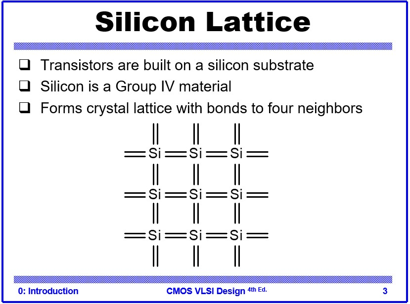
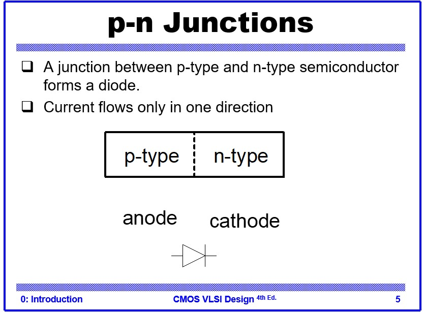
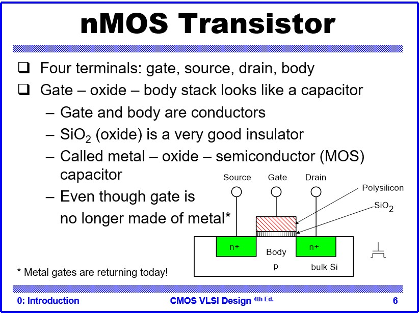
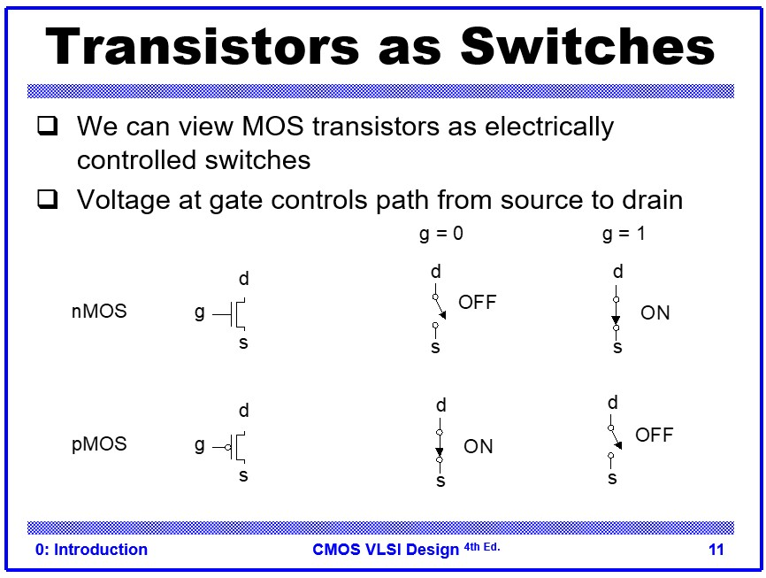
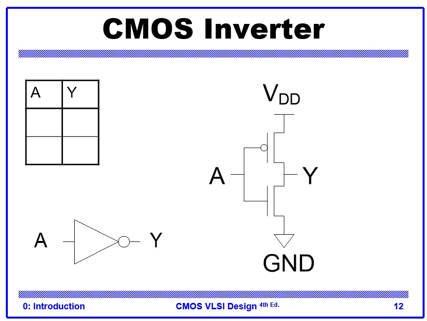
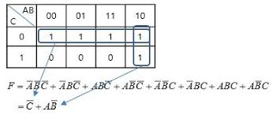

# Introduction

* IC Device의 종는는

수동 소자와 능동소자로 구분 지을 수 있다.

* 수동 : 저항, 커패시터, 인덕터
* 능동 : Diode, BJT, FET

 
 

`수동+능동+wire+기판`

 

이 4가지 요소가 한가지 chip으로 구성되어 있고, 계속된 적층된 구조로 만드는 것이 chip이다.
chip의 집적도가 높아지면서 그 크기는 점점 작아지고 있다.
크기가 작아지면서 생길 수 있는 장점은

* 1. 코스트가 낮아진다
* 2. 가격이 저렴해진다.
* 3. 퍼포먼스가 올라간다. (속도, power) 
  
로 있습니다.
 
 

# Silicon

실리콘은 4족 구조로 **외각에 4개의 전자와 정공**을 두고 있다. 두 개의 전압은 **1.6 x 10^19** 으로 똑같은 크기를 가진다.

예시로 3족 구조에 5개의 정공이 있는 구조의 물질로 반도체를 제작하면 p형,
반대라면 n type 반도체라고 하기도 한다.

 전자의 이동도는 정공의 이동도보다 일반적으로 훨씬 높다. 이 때문에 **NMOS (N-type Metal-Oxide-Semiconductor)** 트랜지스터는 **PMOS (P-type Metal-Oxide-Semiconductor)** 트랜지스터보다 동일한 크기에서 약 2배 정도 더 많은 전류를 흘려보낼 수 있습니다. 이 이동도 차이는 CMOS 회로 설계에서 매우 중요한 고려사항이다.

# p-n junction

p type, n tpe의 접합으로 이루어져있다.
접합을 하게 되면 두개의 다른 band level을 맞춰서, 휘어진다.

# MOSFET

metal, oxide, semiconductor, field, effect, transistor0

field 총 4개의 전계를 다뤄서 수직 수평을 관리한다. 

* Field 수직 수평 5v를 주는데도 nmos와 pmos 마다 차이가 있다.
  수평의 경우 gate와 body의 전압 상하관계가 의미없지만,
  수직의 경우 gate가 무조건 body보다 전압이 커야한다.

* gate의 전압(threshold volatate = 0.7v)이 인가되면 body 아래에서 부터 전자가 올라와서 들러붙어(effect), 채널을 형성하게 된다.

* 전압을 기준으로 하여, 채널이 연결되는 도체와, 채널이 끊겨있는 부도체의 형태로 바뀌게 되어 **반도체**. 라고 부르는 것이다.

* 기본적으로 학부에서 다뤘던 mosfet들은 다리 단자가 3개일텐데,
  body에서 무언가를 뽑아내고 싶을때는, 물리적으로 힘들기 때문에 nmos 옆에 있는 pmos에서 뽑아낸다. 기본적으로 p type에는 케리어가 많아서 저항이 낮기 때문에 이러한 형태로 뽑아낸다.

 

# Swith

앞서 설명드린 도체와 부도체로 바뀌는 원리를 이용하여 스위치 처럼 사용할 수 있다.

* nmos는 기준 전압이 0v, pmos는 기준전압이 5v로 body에 잡혀져있다.
nmos의 gate에 전압인 가되면 기준 전압을 충족하여, 수직으로 전계가 형성되어 스위치가 on이 되도록 한다.

* pmos는 기준 전압이 5v 라서 0v 인가되면 수직의 전계가 형성된다.

* nmos는 기준전압이 0v라서, 5v가 인가되면 수평의 전계가 형성된다.

 

# Inverter

인버터는 가장 기본적인 논리 게이트로, 입력 신호를 반전시켜 출력합니다. CMOS 기술을 사용한 인버터는 NMOS와 PMOS를 조합하여 구성됩니다.

입력 A에 '1' (높은 전압, Vdd)이 인가될 때:

NMOS의 게이트에 높은 전압이 인가되어 NMOS가 켜집니다 (On).
PMOS의 게이트에 높은 전압이 인가되어 PMOS는 꺼집니다 (Off).
따라서 출력(Output)은 NMOS를 통해 **GND ('0')**와 연결됩니다.
입력 A에 '0' (낮은 전압, GND)이 인가될 때:

NMOS의 게이트에 낮은 전압이 인가되어 NMOS가 꺼집니다 (Off).
PMOS의 게이트에 낮은 전압이 인가되어 PMOS가 켜집니다 (On).
따라서 출력(Output)은 PMOS를 통해 **Vdd ('1')**와 연결됩니다.
이러한 논리로 CMOS 인버터 회로가 구성됩니다.* A에 1이 인가되면  NMOS가 작동되어, output이 gnd(0)와 연결된다.
* A에 0이 인가되면  PMOS가 작동되어, output이 vdd(1)와 연결된다.

이러한 논리로 CMOS로 inverter회로가 구성된다.

# 카르노맵

복잡한 부울 대수식을 분석할 떄 유용하게 사용된다. 

* 다음과 같은 사진에서 1(또는 0)의 영역에 한해서 공통적인 부분을 엮어낸다.

* 가로축 같은 1의 의 값을 지닌 것은 C가 0일때 공통적으로 일어나므로 !C의 형태로 쓰는 것이 옳다.

* 그리고 세로축으로 같은 1의 값을 지닌 A!B를 더 해준다.

이와 같이 복잡한 회로를 간략화 시켜서 성능을 최적화 하는데 사용할 수 있습니다.
