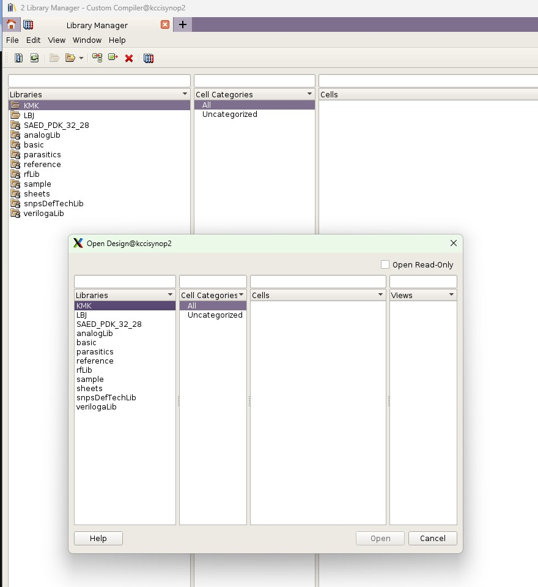
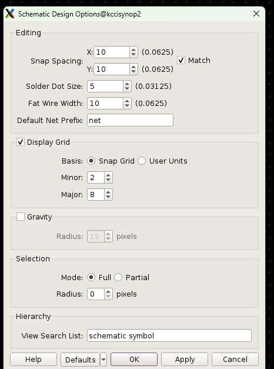
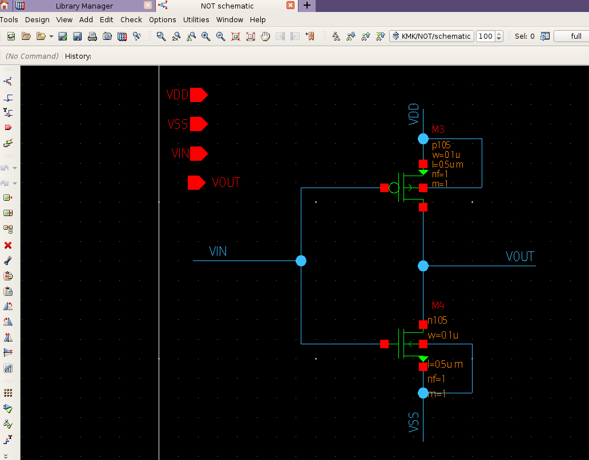
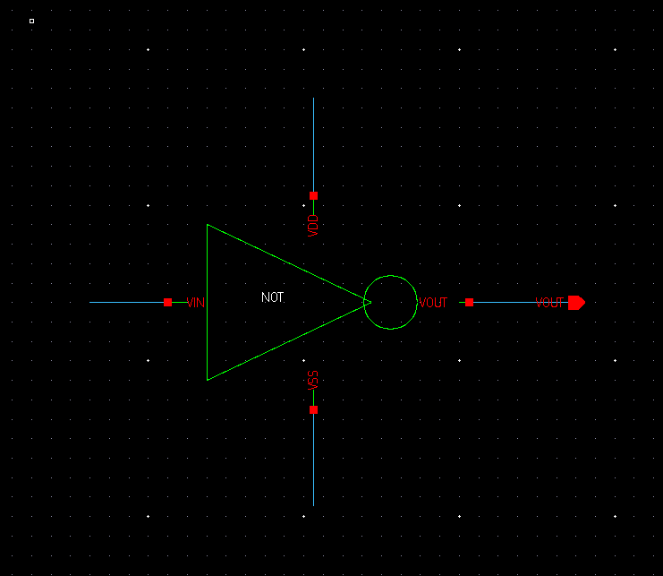
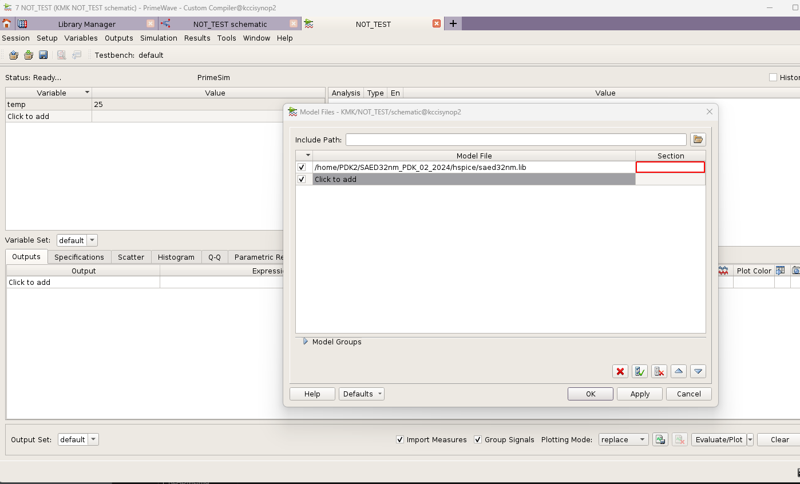
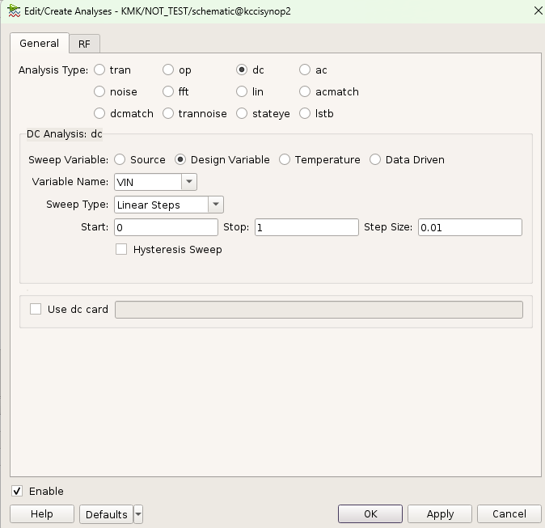
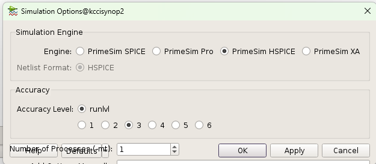
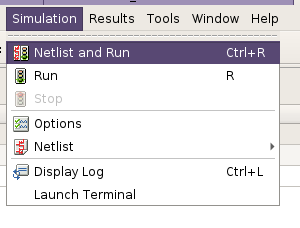
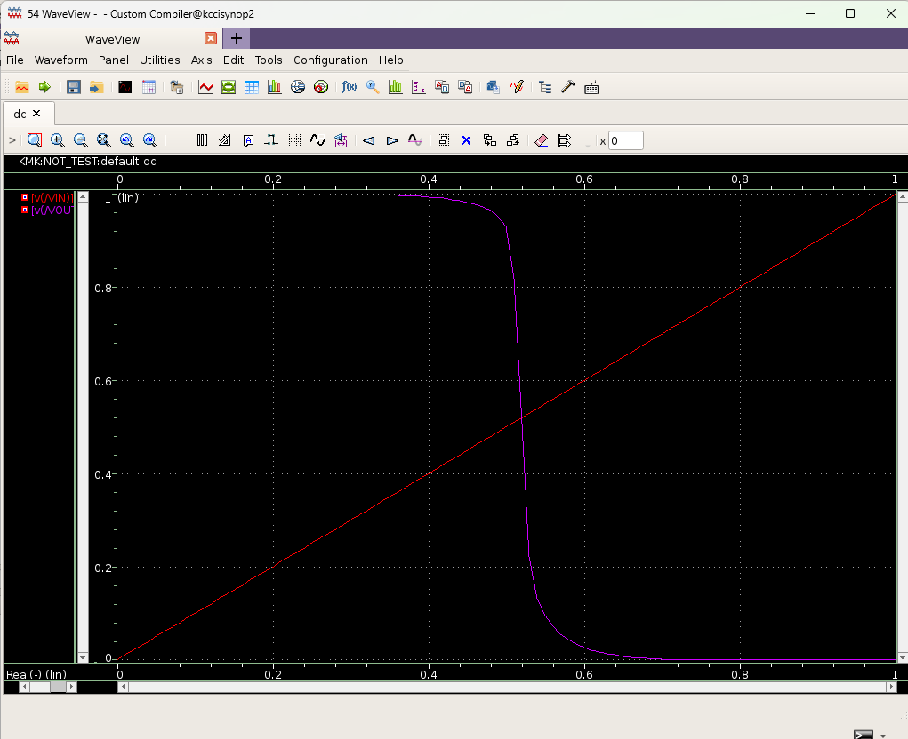

`시놉시스 디자인 컴파일러`의 기본적인 사용법에 대해서 얘기해보겠습니다.




# 1. 라이브러리 생성

우선적으로 컴파일러의 **라이브러리를** 생성 해줍니다.

* **라이브러리** 매니저에서 `file` -> `new` -> `laibrary`를 통해서 생성 가능합니다.

<br>
<br>

<br>
<br>
<br>
<br>
<br>
<br>
# 2. cell view 생성


다음으로 **스케메틱**을 보는 방법입니다 .
* `file` -> `new` -> `cell view`를 통해서 스케메틱을 볼 수 있습니다.
  


`schemetic`의 간격을 줄이기성성위해서 다음과 같이 설정해 줄 수도 있습니다.

* x-> (10->5)
* y-> (10->5)
<br>
<br>
<br>
<br>
<br>
# 3.소자 추가

다음으로 `add`를 통해 소자들을 추가할 수 있습니다.


i키를 눌러서 `instance` 기능을 사용합니다.

라이브러리에서 `body`까지 포함한 4pin `NMOS`를 가져와 줍니다.

원 클릭 방식이라 드래그하고 바로 누르고, ESC를 누르면 해당 모드가 종료됩니다.


# 4. 게이트 구성




```
Synopsys 디자인 컴파일러 단축키

w: wire 모드 - 회로도에서 선(wire)을 그릴 때 사용

p: pin 모드 - 디자인에 핀(pin)을 배치하거나 편집할 때 사용

l: label 모드 - 사용할 이름을 보기 좋게 표시할 수 있습니다.

u: 되돌리기 (undo) - 마지막 작업을 취소할 때 유용. 실수했을 때 되돌리기 가능
Shift + u: 다시 실행 (redo) - 'u'로 되돌린 작업을 다시 원래대로 되돌리고 싶을 때 사용.

f: 화면에 맞추기 (fit to screen) - 디자인 전체를 화면에 꽉 차게 보여줄 때 사용.

z: 확대/축소 (zoom) - 마우스로 드래그해서 특정 영역을 확대하거나 축소.

Esc: 명령 취소 - 현재 활성화된 명령이나 모드를 취소하고 싶을 때 사용.

Ctrl + s: 저장 (save) - 작업 중인 디자인을 저장할 때 사용.

```

다음과 같은 단축키로 간단하게 `NOT GATE`를 구성하였습니다.


# 5. Symbol


 다음은 심볼을 만드는 방법입니다.

 다른 라이브러리에서 `instance`해서 사용할 수 있게 심볼을 만들어주는 과정입니다.

상하좌우 원하는 `input`, `output`을 배치할 수 있게 됩니다.

넣는 도형같은 경우에 직접적인 기능에 연관되어있지 않지만 wire가 제대로 처리되었는지 확인하는 것은 굉장히 중요한 절차입니다.

## <NOT GATE 완성본>
<br>




# 6. prime wave form으로 검사하기




직접적인 테스트 절차입니다.


* 1.*prime wave form*을 검사하기 위해서 사용할 `model file`을 불러와줍니다.




* 2. 검사에서 `analysis type`은 dc로 지정되었고 `linear`하게 `0`에서 `1`의 범위를 쓸어 지나가며 테스트 결과를 출력합니다.

<br>



* 3. 시뮬레이션 세팅에서 엔진을 `primesim HSPICE`로 지정해 주었습니다.정확도는 3레벨로 지정하였습니다.


* 4.`expression`의 경우에는 VIN과 VOUT을 지정 해두고 앞서 말한대로 DC 타입으로 설정해둡니다. 



* 5. 앞선 과정이 전부 끝났다면 넷리스트를 만들며 테스트를 진행합니다.

<br>

# 시뮬레이션 결과 확인





* `VIN`이 0에서 1로 올라갈 때, 제대로 `inverting`동작을 하고 있는지 확인 할 수 있었다.
