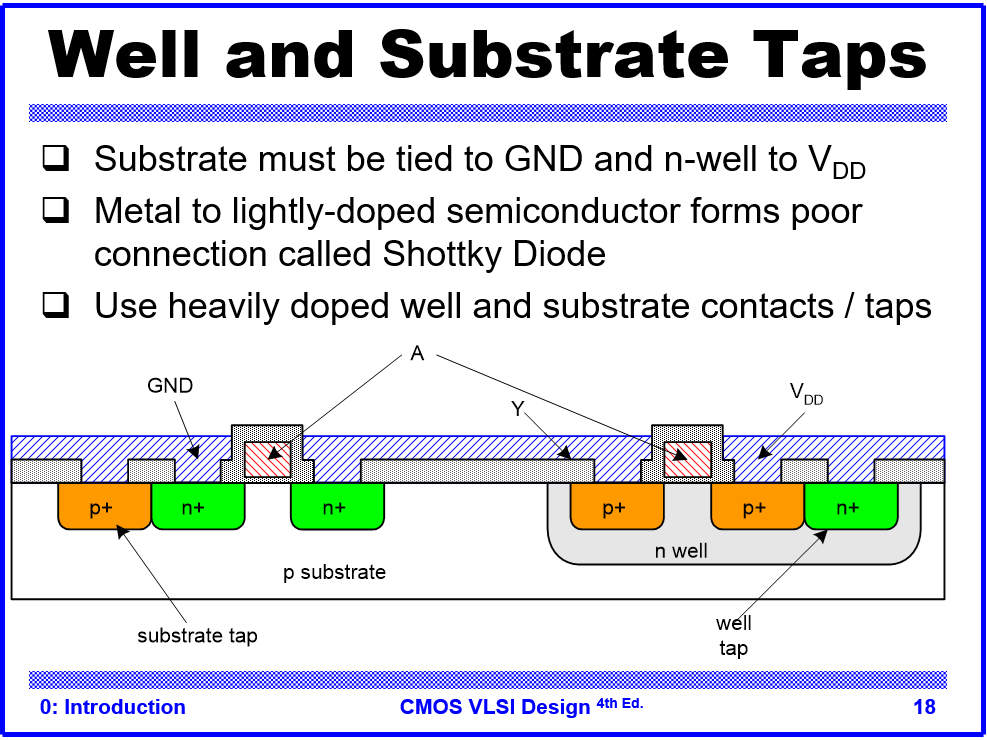
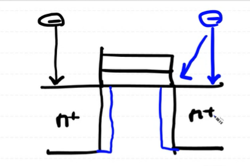
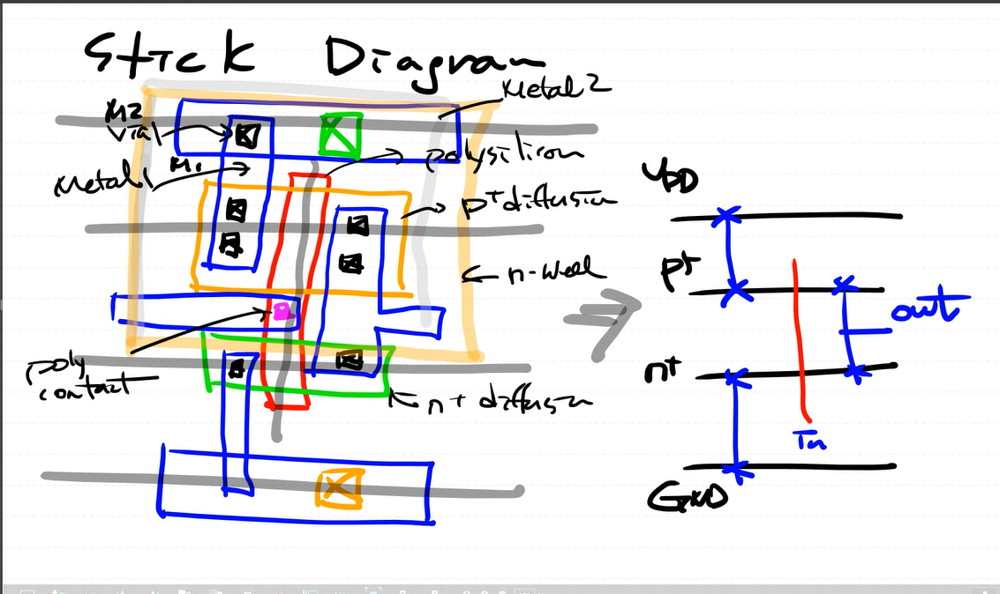

다음은 공정을 마친 `MOS`를 간략하게 표현한 것이다.
설계 영역의 이야기를 주로 하기 위해 8대 공정에 대한 이야기는 간략화 한다.

* oxidation 과정과 photoresist, uv, eching을하는 것을 반복해서
  원하는 패턴의 gate,source, drain 을 증착 시킨다.

* dopamant 과정을 통해서 p 또는 n well을 기판 위에 생성한다.

* `n well` 혹은 `p well`에 반대되는 `diffusion region`을 생성하고, `body`를 끌어내는 `p region`과 `n region`의 옆에 붙혀둔다. 

* `electron`의 `mobility`가 `hole`의 `mobility`가 훨씬 빠르기 때문에, 
  `NMOS`의 `CHANNEL lenth`를 `hole`보다 조금 줄이거나, 조치를 해야될 필요가 있다.
   (Ids= 1/2 un Cox W/L (Vgs - Vth)^2) (un= 전자이동도, Cox = 산화층 커패시턴스, W= channel 높이, L = channel 폭)

* L의 값을 임의로 조정하기엔 어렵기 때문에 W= 높이를 조정하는 것으로 해당 mobility 값을 조정한다.
               

# Dopament (gas or Ion)

* 이온 주입(Ion Implantation)을 통해 n-diffusion을 형성하면, 주입된 이온이 실리콘 격자와 충돌하며 여러 각도로 흩어지는 측면 산재(Lateral Straggle) 현상이 발생합니다. 이로 인해 설계했던 것보다 확산 영역이 더 넓게 형성됩니다. 결과적으로 유효 채널 길이(L_eff)가 의도한 것보다 짧아져 **단채널 효과(Short Channel Effects)**가 발생하고, 이는 누설 전류 증가 등의 문제로 이어질 수 있습니다.

# Design rules

칩을 실패 없이 만들고(수율 향상), 제대로 동작하게(신뢰성 확보) 하기 위한 물리적 설계 규칙입니다.

* 폭(Width) 규칙: 선이 너무 가늘어 끊어지는 것(단선)을 방지합니다.

* 간격(Spacing) 규칙: 선들이 너무 가까워 달라붙는 것(합선)을 방지합니다.

* 중첩(Enclosure) 규칙: 연결 부위(Via, Contact)가 안정적으로 접속되도록 합니다.
설계가 끝나면 **DRC(Design Rule Checking)** 라는 자동화 툴로 이 규칙들을 잘 지켰는지 검사합니다.

# Stick diagram 

복잡한 레이아웃을 그리기 전, 부품의 연결 관계만을 간략하게 표현한 그림입니다. 실제 크기나 비율은 무시하고 '어떻게 연결되는지'에 집중합니다.

* 콘택(Contact): 첫 금속(M1)과 소자(트랜지스터)를 연결합니다.
* 비아(Via): 금속층과 금속층(예: M1 ↔ M2)을 연결합니다.
배선 방향의 원칙

홀수 층(M1, M3...)은 세로, 짝수 층(M2, M4...)은 가로로 배선하는 것이 일반적입니다.
이유: 신호 간섭을 줄이고, 자동화 툴이 배선을 더 효율적으로 하도록 돕기 위함입니다.

